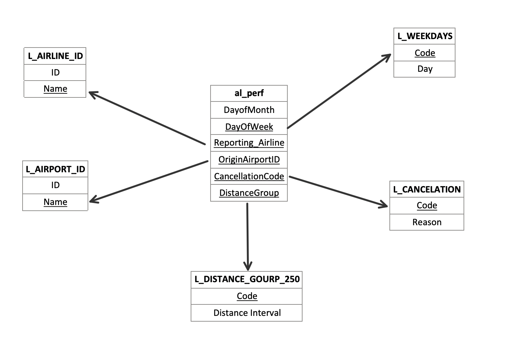

# DSAN 6300: Database Systems and SQL
## Mini-Project 2024

### 1. `Introduction`
The aviation industry produces a vast amount of data, which plays a pivotal role in monitoring, evaluating, and optimizing airline performance. The Airline On-Time Statistics and Delay Causes dataset[^1], provided by the United States Department of Transportation, offers a comprehensive record of flight data, including flight numbers, departure and arrival times, and causes of delays and cancellations.

In this report, we will analyze the dataset to identify patterns and trends in flight delays and cancellations and assess how external and operational factors influence these metrics.

### 2. `Data`
#### 2.1. `Data Collection`
The data for this report was collected from the United States Department of Transportation website for December 2020.

The dimension tables were sourced from the provided project materials, which were crucial for building a structured star schema to further enhance the analysis.

#### 2.2. `About the Dataset`
Fact Table: `al_perf.csv` contains 108 different metrics related to flight performance, including delays in arrival and departure, cancellations, and causes of delays and cancellations for over 370,000 flights in December 2020.

Columns used for analysis:
  
| Column Name| Description | 
| :--------:| :-------| 
| DayofMonth | Day of Month |
|DayOfWeek	|Day of Week|
|Reporting_Airline|	Unique Carrier Code|
|OriginAirportID	|Origin Airport, Airport ID. An identification number assigned by US DOT to identify a unique airport|
|OriginCityName	|Origin Airport, City Name|
|OriginState|	Origin Airport, State Code|
|DestAirportID	|Destination Airport, Airport ID. An identification number assigned by US DOT to identify a unique airport|
|DepDelay|	Difference in minutes between scheduled and actual departure time. Early departures show negative numbers|
|DepDelayMinutes|	Difference in minutes between scheduled and actual departure time. Early departures set to 0|
|Cancelled|	Cancelled Flight Indicator (1=Yes)|
|CancellationCode	|Specifies The Reason For Cancellation|
|DistanceGroup	|Distance Intervals, every 250 Miles, for Flight Segment|
|CarrierDelay|	Carrier Delay, in Minutes|
|WeatherDelay	|Weather Delay, in Minutes|
|NASDelay	|National Air System Delay, in Minutes|
|SecurityDelay	|Security Delay, in Minutes|
|LateAircraftDelay|	Late Aircraft Delay, in Minutes|

- Dimension Tables:\
  
| Table| Attributes| 
| :--------:| :-------| 
|L_DISTANCE_GROUP_250 |DistanceGroup|
|L_AIRLINE_ID |(ID, Name) DOT_ID_Reporting_Airline|
|L_AIRPORT |(Code, Name) Dest|
|L_AIRPORT |(Code, Name) Origin|
|L_AIRPORT_ID| (ID, Name) DestAirportID|
|L_AIRPORT_ID| (ID, Name) OriginAirportID|
|L_CANCELATION| (Code, Reason) CancellationCode|
|L_WEEKDAYS |(Code, Day) DayOfWeek|

#### 2.3. `Schema`
The data is origanized in **star-schema**. 

### 3. Requirements
1. Questions
   1. Maximum Delay for each airline.
   2. Earliest departure for each airline. 
   3. Rank days based on busyness, where the busiest day is defind as having the most flights taking off.
   4. Which airport had the highest average departure delay?
   5. For each airline, which airport experienced the highest average departure delay?
   6. For each airport, what was the most frequent reason for flight cancellation?
   7. 3-day rolling average for the number of flights.

2. Report: Maximum 5 pages. 

[^1]:  http://www.transtats.bts.gov/.