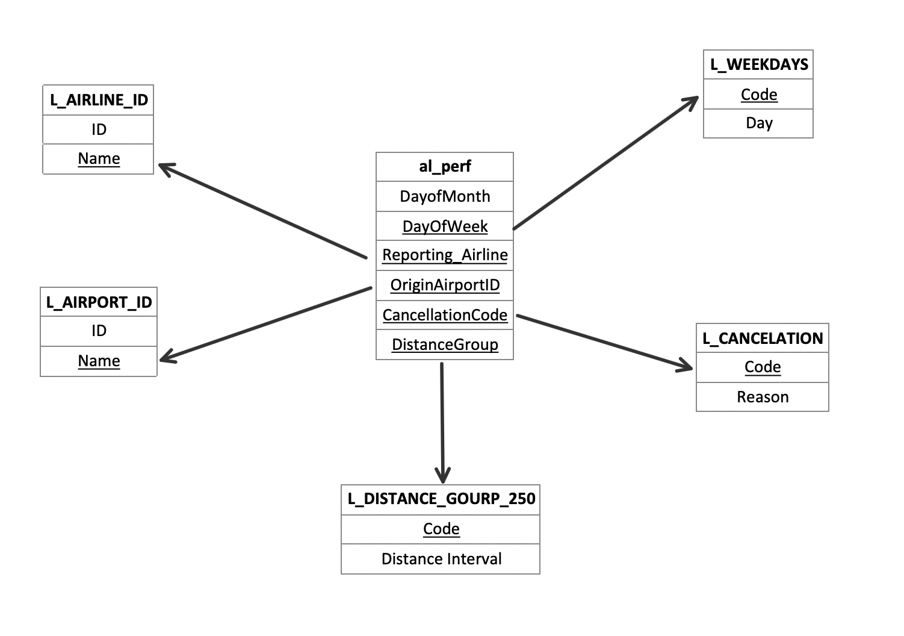

## Introduction

The aviation industry produces a vast amount of data that plays a pivotal role in monitoring, evaluating, and optimizing airline performance. The [Airline On-Time Statistics and Delay Causes dataset](https://www.transtats.bts.gov/), provided by the United States Department of Transportation, offers a comprehensive record of flight data — including flight numbers, departure and arrival times, and causes of delays and cancellations.

This site walks through a SQL-based analysis of the dataset, identifying patterns and trends in flight delays and cancellations, and examines how external and operational factors influence these metrics. For each question below, the SQL query is shown alongside the resulting plot.

## Data

### Data Collection

The data was collected from the United States Department of Transportation website for **December 2020**. Dimension tables were sourced from the provided project materials and were used to build a structured star schema for the analysis.

### About the Dataset

The fact table `al_perf.csv` contains 108 metrics related to flight performance, including arrival/departure delays, cancellations, and delay/cancellation causes for over 370,000 flights in December 2020.

Columns used in this analysis:

| Column Name | Description |
|:---|:---|
| DayofMonth | Day of Month |
| DayOfWeek | Day of Week |
| Reporting_Airline | Unique Carrier Code |
| OriginAirportID | Origin Airport ID (assigned by US DOT) |
| OriginCityName | Origin Airport, City Name |
| OriginState | Origin Airport, State Code |
| DestAirportID | Destination Airport ID (assigned by US DOT) |
| DepDelay | Scheduled vs. actual departure time difference (minutes); early departures are negative |
| DepDelayMinutes | Same as above, but early departures are set to 0 |
| Cancelled | Cancelled flight indicator (1 = Yes) |
| CancellationCode | Reason for cancellation |
| DistanceGroup | Distance intervals, every 250 miles, for the flight segment |
| CarrierDelay | Carrier delay, in minutes |
| WeatherDelay | Weather delay, in minutes |
| NASDelay | National Air System delay, in minutes |
| SecurityDelay | Security delay, in minutes |
| LateAircraftDelay | Late aircraft delay, in minutes |

Dimension tables used:

| Table | Attributes |
|:---|:---|
| L_DISTANCE_GROUP_250 | DistanceGroup |
| L_AIRLINE_ID | (ID, Name) — joined on `Reporting_Airline` |
| L_AIRPORT_ID | (ID, Name) — joined on `OriginAirportID` / `DestAirportID` |
| L_CANCELATION | (Code, Reason) — joined on `CancellationCode` |
| L_WEEKDAYS | (Code, Day) — joined on `DayOfWeek` |

### Schema

The data is organized as a **star schema**:

## Analysis

The sections below each answer one question from the project requirements: the SQL query used, followed by the resulting plot.
